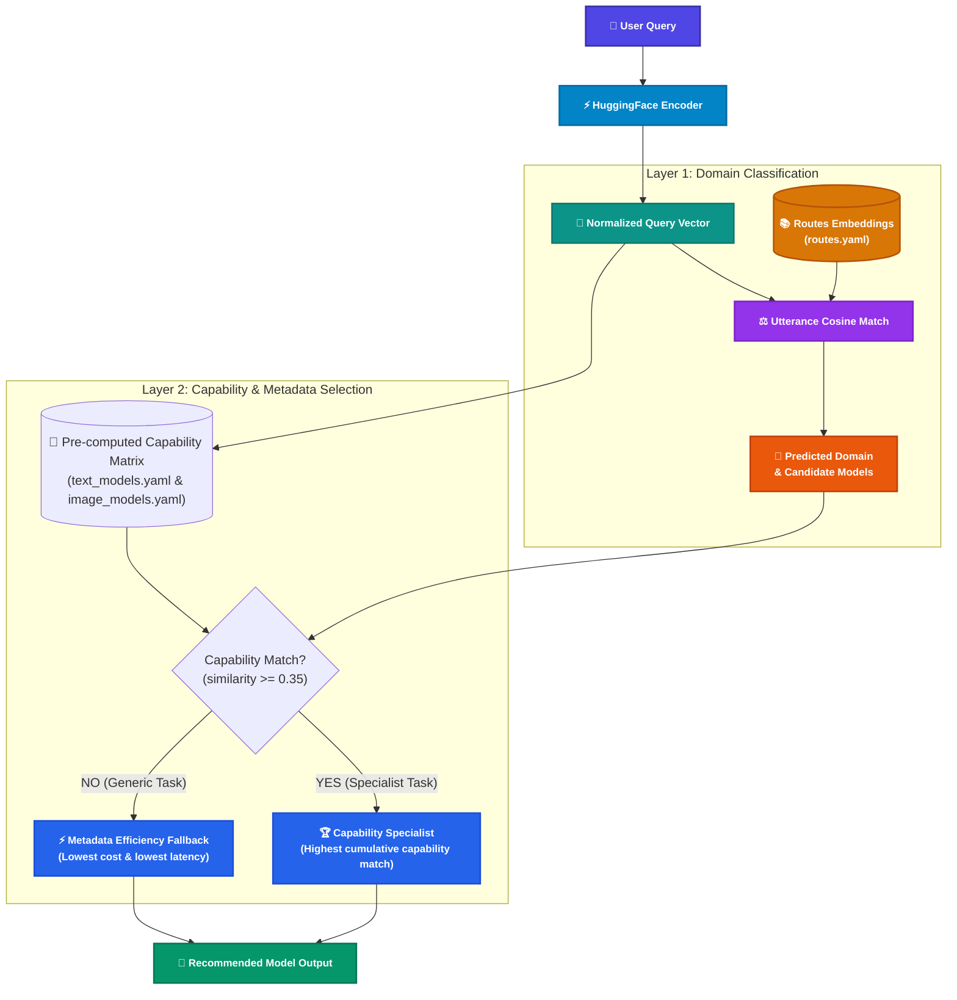

# Semantic LLM Router for Marketing

A decoupled, configuration-driven **Semantic LLM Router** in Python that classifies user queries into marketing-specific domains using local HuggingFace embeddings and selects the optimal LLM model across configured providers (**Anthropic**, **Gemini**, **OpenAI**, and **LiteLLM / Open-Weights**).

> [!NOTE]
> **Zero External LLM / Provider Calls**: The router acts strictly as a low-latency decision-making layer. Provider and model names are metadata; no external API calls or API keys are required. The router runs 100% locally and offline after downloading the embedding model.

---

## Architecture & How It Works

The routing pipeline combines **domain semantic matching** with a **two-stage capability and metadata efficiency selector**:



### 1. Domain Classification (Macro-Routing)
The query is encoded into a 384-dimensional unit vector and compared against 200+ pre-computed route utterances defined in [`config/routes.yaml`](config/routes.yaml). The highest cosine similarity identifies the qualified domain (e.g. `seo_and_content_strategy`, `commercial_visual_production`).

### 2. Dynamic Capability Matching (Micro-Routing)
- All 60+ unique capabilities across models are dynamically harvested and pre-encoded into an embedding matrix on startup.
- The router calculates cosine similarity against the query vector in $<0.1\text{ms}$ (zero extra neural network inference).
- **Cumulative Capability Match**: For each candidate model in the domain, the router sums the scores of all capabilities that meet or exceed the threshold ($\ge 0.35$). The model covering the most and strongest matching capabilities wins.

### 3. Metadata Efficiency Fallback (Cost & Latency Optimization)
- When a query is standard or generic (no capability reaches $\ge 0.35$), the router avoids arbitrary YAML list ordering.
- Instead, it selects the winner via **operational efficiency**:
  $$\text{Efficiency Score} = (\text{Cost Score} \times 0.6) + (\text{Latency Score} \times 0.4)$$
- Lower cost per unit and faster response times (`avg_latency_ms`) are mathematically rewarded.

---

## Supported Providers & Models

Model configurations and metadata live in [`config/text_models.yaml`](config/text_models.yaml) and [`config/image_models.yaml`](config/image_models.yaml):

* **Anthropic**: `claude-haiku-4-5-20251001`, `claude-sonnet-5`, `claude-opus-5-5`
* **OpenAI**: `gpt-5.1-instant`, `gpt-5.1`, `gpt-5.1-thinking`, `gpt-image-1`
* **Gemini**: `gemini-2.5-flash-lite`, `gemini-2.5-flash`, `gemini-2.5-pro`, `gemini-3-pro-image`
* **LiteLLM / Open-Weights**: `qwen3-coder-32b-instruct`, `deepseek-r1`, `llama-4-scout`, `llama-4-maverick`, `mistral-large-latest`, `flux-1.1-pro`, `stable-diffusion-3-5-large`

---

## How to Run

### On macOS / Linux

```bash
# 1. Clone or navigate to the project directory
cd semantic-router

# 2. Create and activate a virtual environment (Python 3.10+)
python3 -m venv .venv
source .venv/bin/activate

# 3. Install dependencies
pip install -r requirements.txt

# 4. Start the API server
uvicorn app.main:app --host 0.0.0.0 --port 8000 --reload
```

---

### On Windows

#### Using PowerShell:
```powershell
# 1. Navigate to the project directory
cd semantic-router

# 2. Create and activate a virtual environment
python -m venv .venv
.venv\Scripts\Activate.ps1

# 3. Install dependencies
pip install -r requirements.txt

# 4. Start the API server
uvicorn app.main:app --host 0.0.0.0 --port 8000 --reload
```

#### Using Command Prompt (`cmd.exe`):
```cmd
cd semantic-router
python -m venv .venv
.venv\Scripts\activate.bat
pip install -r requirements.txt
uvicorn app.main:app --host 0.0.0.0 --port 8000 --reload
```

---

## Testing the API

Once the server is running at `http://localhost:8000`:

### 1. Specialized SEO & JSON Schema Query (Capability Match)
```bash
curl -X POST "http://localhost:8000/route" \
  -H "Content-Type: application/json" \
  -d '{"query": "Write SEO-optimised product descriptions for 50 running shoe SKUs. Output as structured JSON."}'
```

**Response:**
```json
{
  "query": "Write SEO-optimised product descriptions for 50 running shoe SKUs. Output as structured JSON.",
  "domain": "seo_and_content_strategy",
  "available_models": [
    { "model": "claude-sonnet-5", "provider": "Anthropic" },
    { "model": "qwen3-coder-32b-instruct", "provider": "LiteLLM" }
  ],
  "recommended_model": "qwen3-coder-32b-instruct",
  "llm_provider": "LiteLLM"
}
```
*(Selected via capability match for `schema_markup_generation` and `technical_seo_code`)*

---

### 2. Specialized Image Typography Query (Capability Match)
```bash
curl -X POST "http://localhost:8000/route" \
  -H "Content-Type: application/json" \
  -d '{"query": "Design an event poster with headline SUMMIT 2026. Typography must render perfectly legibly."}'
```

**Response:**
```json
{
  "query": "Design an event poster with headline SUMMIT 2026. Typography must render perfectly legibly.",
  "domain": "marketing_collateral_and_layout",
  "available_models": [
    { "model": "gemini-3-pro-image", "provider": "Gemini" },
    { "model": "flux-1.1-pro", "provider": "LiteLLM" }
  ],
  "recommended_model": "flux-1.1-pro",
  "llm_provider": "LiteLLM"
}
```
*(Selected via capability match for `fine_typography_in_images`)*

---

### 3. Generic Query (Metadata Efficiency Fallback)
```bash
curl -X POST "http://localhost:8000/route" \
  -H "Content-Type: application/json" \
  -d '{"query": "What is the schedule for our launch next Monday?"}'
```

**Response:**
```json
{
  "query": "What is the schedule for our launch next Monday?",
  "domain": "social_media_and_brand_storytelling",
  "available_models": [
    { "model": "gpt-5.1", "provider": "OpenAI" },
    { "model": "llama-4-scout", "provider": "LiteLLM" }
  ],
  "recommended_model": "llama-4-scout",
  "llm_provider": "LiteLLM"
}
```
*(No specialized capability matched $\ge 0.35$; `llama-4-scout` is selected as the cheapest & fastest model)*

---

## Interactive Documentation

Open in your browser:
* **Swagger UI**: [http://localhost:8000/docs](http://localhost:8000/docs)
* **Health Check**: [http://localhost:8000/health](http://localhost:8000/health)