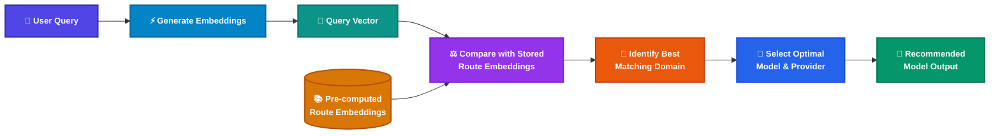

# Semantic LLM Router for Marketing

A decoupled, configuration-driven **Semantic LLM Router** in Python that classifies user queries into marketing-specific domains using local HuggingFace embeddings and selects the optimal LLM model across configured providers (**Anthropic**, **Gemini**, **OpenAI**, and **LiteLLM / Open-Weights**).

> [!NOTE]
> **Zero External LLM / Provider Calls**: The router acts strictly as a low-latency decision-making layer. Provider and model names are metadata; no external API calls or API keys are required. The router runs 100% locally and offline after downloading the embedding model.

---

## How It Works



---

## Supported Providers & Models

Model configurations and metadata live in [`config/text_models.yaml`](file:///Users/dineshlalam15/Desktop/semantic-router/config/text_models.yaml) and [`config/image_models.yaml`](file:///Users/dineshlalam15/Desktop/semantic-router/config/image_models.yaml):

* **Anthropic**: `claude-3-5-sonnet-20241022`, `claude-3-5-haiku-20241022`, `claude-opus-4-5`
* **OpenAI**: `gpt-4o`, `gpt-4o-mini`, `o1`, `o3-mini`, `dall-e-3`
* **Gemini**: `gemini-2.0-flash`, `gemini-1.5-pro`, `gemini-1.5-flash`, `imagen-3`
* **LiteLLM**: `deepseek-r1`, `llama-3.3-70b-instruct`, `qwen-2.5-coder-32b`, `flux-1-dev`, `stable-diffusion-3-5-large`
* **Adobe Firefly**: `firefly-image-3`, `firefly-vector`

---

## How to Run

### On macOS / Linux

```bash
# 1. Clone or navigate to the project directory
cd semantic-router

# 2. Create and activate a virtual environment (Python 3.10+)
python3 -m venv .venv
source .venv/bin/activate

# 3. Install dependencies
pip install -r requirements.txt

# 4. Start the API server
uvicorn app.main:app --host 0.0.0.0 --port 8000 --reload
```

---

### On Windows

#### Using PowerShell:
```powershell
# 1. Navigate to the project directory
cd semantic-router

# 2. Create and activate a virtual environment
python -m venv .venv
.venv\Scripts\Activate.ps1

# 3. Install dependencies
pip install -r requirements.txt

# 4. Start the API server
uvicorn app.main:app --host 0.0.0.0 --port 8000 --reload
```

#### Using Command Prompt (`cmd.exe`):
```cmd
cd semantic-router
python -m venv .venv
.venv\Scripts\activate.bat
pip install -r requirements.txt
uvicorn app.main:app --host 0.0.0.0 --port 8000 --reload
```

---

## Testing the API

Once the server is running at `http://localhost:8000`:

### 1. Copywriting Query (cURL)
```bash
curl -X POST "http://localhost:8000/route" \
  -H "Content-Type: application/json" \
  -d '{"query": "Write a 600-word press release for the global commercial launch of an innovative product line."}'
```

**Response:**
```json
{
  "query": "Write a 600-word press release for the global commercial launch of an innovative product line.",
  "domain": "campaign_and_advertising_copy",
  "recommended_model": "claude-3-5-haiku-20241022",
  "llm_provider": "Anthropic"
}
```

### 2. Commercial Visual Production Query (cURL)
```bash
curl -X POST "http://localhost:8000/route" \
  -H "Content-Type: application/json" \
  -d '{"query": "Render a cinematic exterior hero shot of a flagship smart hardware device on a sleek minimalist desk."}'
```

**Response:**
```json
{
  "query": "Render a cinematic exterior hero shot of a flagship smart hardware device on a sleek minimalist desk.",
  "domain": "commercial_visual_production",
  "recommended_model": "dall-e-3",
  "llm_provider": "OpenAI"
}
```

### 3. Market Research Query (PowerShell)
```powershell
Invoke-RestMethod -Uri "http://localhost:8000/route" `
  -Method Post `
  -ContentType "application/json" `
  -Body '{"query": "Analyze competitor pricing tiers and messaging claims across the top 4 players in project management software."}' | ConvertTo-Json
```

**Response:**
```json
{
  "query": "Analyze competitor pricing tiers and messaging claims across the top 4 players in project management software.",
  "domain": "market_intelligence_and_research",
  "recommended_model": "claude-3-5-sonnet-20241022",
  "llm_provider": "Anthropic"
}
```

---

## Interactive Documentation

Open in your browser:
* **Swagger UI**: [http://localhost:8000/docs](http://localhost:8000/docs)
* **Health Check**: [http://localhost:8000/health](http://localhost:8000/health)