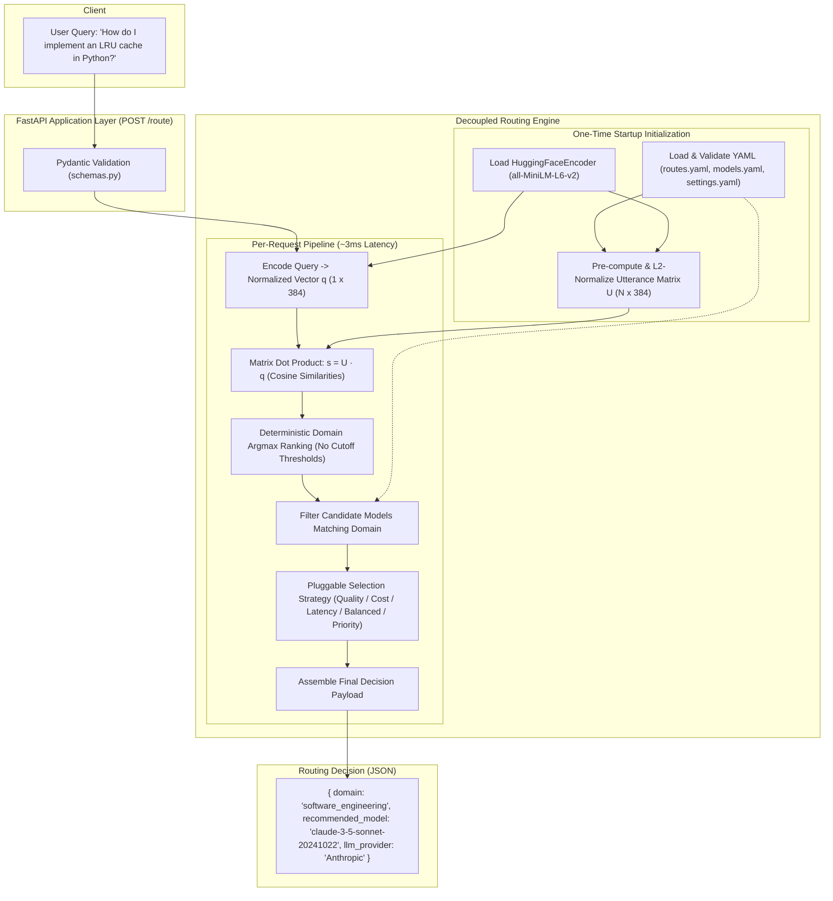

# Semantic LLM Router

A high-performance, configuration-driven, and decoupled **Semantic LLM Router** in Python. The router acts strictly as a decision-making layer: it analyzes an incoming user query, classifies it into the most relevant semantic domain using local HuggingFace embeddings without manual threshold cutoffs, evaluates available LLM models across configured providers (**OpenAI**, **Gemini**, **Anthropic**, and **LiteLLM**), and returns the recommended model and provider.

> [!IMPORTANT]
> **Zero LLM / Provider API Calls**: The router does **not** call OpenAI, Gemini, Anthropic, or LiteLLM APIs. Model and provider names are configuration metadata only. The router executes fully offline after downloading the embedding model.

---

## 1. Architecture Overview

The system decouples **semantic domain classification** from **model selection**. Intent classification is independent of physical model infrastructure, allowing models, prices, and capabilities to evolve without re-indexing semantic routes.



---

## 2. Key Architectural Decisions

### A. Query → Domain → Model vs Query → Model Directly
We specifically implement **Query → Domain → Model**:
* **Decoupled Lifecycle**: Domains (e.g. `software_engineering`, `stem_mathematics`) represent human intent and remain stable for years. Models, provider rates, and token windows change frequently. With a two-stage design, adding a model or altering pricing **never requires recomputing utterance embeddings**.
* **Governance & Dynamic Policy**: Allows applying multi-attribute selection policies (e.g., "use cost-optimized models for chat, but quality-optimized models for code").
* **Auditability**: Produces clear reasoning for every routing decision (`domain` + `confidence_score` + `matched_utterance` + `selection_strategy`).

### B. Deterministic Ranking (No Manual Similarity Thresholds)
Standard semantic routers often rely on manual thresholds (`if similarity > 0.82`), causing valid queries to be dropped if phrasing diverges slightly.
* **Our Mechanism**: Computes the cosine similarity of the query vector $\mathbf{q}$ against all pre-computed route utterances $\mathbf{U}$. For each domain $d$, we determine:
  $$\text{Score}(d) = \max_{u \in d} \cos(\mathbf{q}, \mathbf{u})$$
* Domains are sorted deterministically by score in descending order (with domain priority as tie-breaker), selecting the $Argmax$.
* **Queries are never dropped**. The full ranked candidate list is preserved and returned for observability and ambiguity tracking.

---

## 3. Project Structure

```
semantic-router/
├── app/
│   ├── __init__.py
│   ├── main.py              # FastAPI entrypoint, lifespan startup, structured logging
│   ├── routes.py            # API endpoints: POST /route, GET /health, GET /routes, GET /models
│   ├── schemas.py           # Pydantic validation contracts for configs, requests, responses
│   ├── config_loader.py     # YAML loader with strict validation and fail-fast checks
│   ├── encoder.py           # HuggingFaceEncoder wrapper with L2-normalization
│   ├── semantic_router.py   # Pre-computed matrix, vectorized dot product, argmax ranking
│   └── model_selector.py    # Candidate filtering and 5 pluggable selection strategies
├── config/
│   ├── routes.yaml          # 5 semantic domains with 15+ diverse sample utterances each
│   ├── models.yaml          # Models across OpenAI, Gemini, Anthropic, LiteLLM with rich metadata
│   └── settings.yaml        # Global encoder, device, and strategy settings
├── tests/
│   ├── __init__.py
│   ├── test_config.py       # Validation tests, duplicate detection, uncovered domains
│   ├── test_encoder.py      # Embedding dimensions and unit vector normalization
│   ├── test_router.py       # Domain classification, ambiguity handling, non-threshold tests
│   ├── test_model_selector.py # Candidate filtering and all 5 selection strategies
│   └── test_api.py          # FastAPI endpoint integration tests with TestClient
├── requirements.txt         # Production dependencies
├── pyproject.toml           # Packaging and pytest configuration
├── .env.example             # Environment variable template
├── .gitignore               # Standard ignores
└── README.md                # Project documentation
```

---

## 4. Configuration Guide

All routing knowledge lives in `config/` YAML files—**zero routing rules are hardcoded in Python**.

### A. Configuring Routes (`config/routes.yaml`)
Each route defines a domain, priority tie-breaker, description, and representative utterances:

```yaml
routes:
  - name: "software_engineering"
    description: "Programming, algorithms, debugging, API design, DevOps."
    priority: 10
    utterances:
      - "How do I implement an LRU cache in Python?"
      - "Debug this Java NullPointerException stack trace."
      - "Write a SQL query to find the second highest salary in an employees table."
      # 15+ diverse utterances...
```

#### How to Add a New Domain:
Add a new entry to `routes.yaml`:
```yaml
  - name: "cybersecurity"
    description: "Vulnerability analysis, penetration testing, and security hardening."
    priority: 8
    utterances:
      - "Explain how SQL injection vulnerabilities occur and how to prevent them."
      - "How do I configure Content Security Policy CSP headers?"
      - "Analyze this snort rule for buffer overflow detection."
```
*Make sure to assign at least one model in `models.yaml` to the new domain.*

#### How to Add New Utterances:
Simply append new sample questions or phrases under the domain's `utterances` list. They will be automatically indexed at startup.

---

### B. Configuring Models (`config/models.yaml`)
Supports all 4 providers: **OpenAI**, **Gemini**, **Anthropic**, and **LiteLLM**. Clearly separates required routing fields from reserved optimization metadata:

```yaml
models:
  - provider: "Anthropic"
    model_name: "claude-3-5-sonnet-20241022"
    domains:
      - "software_engineering"
      - "stem_mathematics"
      - "legal_document_analysis"
    capabilities:
      - "coding"
      - "complex_reasoning"
      - "tool_use"
    metadata:
      context_window: 200000
      input_cost_per_m: 3.00
      output_cost_per_m: 15.00
      latency_p90_ms: 1200
      reasoning_capability: 9.8
      coding_capability: 9.9
      vision_capability: true
      tool_use: true
      availability: 0.999
      priority: 10
```

#### How to Add a New Provider or Model:
Append a new block under `models:` in `models.yaml`:
```yaml
  - provider: "LiteLLM"
    model_name: "mistral-large-2407"
    domains:
      - "legal_document_analysis"
      - "content_marketing"
    capabilities:
      - "multilingual"
      - "reasoning"
    metadata:
      context_window: 128000
      input_cost_per_m: 2.00
      output_cost_per_m: 6.00
      latency_p90_ms: 950
      reasoning_capability: 9.1
      priority: 8
```

---

### C. Configuring Router Settings (`config/settings.yaml`)
```yaml
encoder:
  model_name: "sentence-transformers/all-MiniLM-L6-v2"
  device: "cpu"      # or "mps" on Apple Silicon, "cuda" on Nvidia
  batch_size: 32

routing:
  default_selection_strategy: "quality"  # quality, cost, latency, priority, balanced
  balanced_weights:
    quality: 0.50
    cost: 0.25
    latency: 0.25

server:
  host: "0.0.0.0"
  port: 8000
  log_level: "INFO"
```

---

## 5. Model Selection Strategies

The router implements the **Strategy Pattern** (`SelectionStrategy`) in `app/model_selector.py`:

| Strategy | Selection Criterion | Typical Use Case |
| :--- | :--- | :--- |
| **`quality`** (Default) | Maximizes weighted reasoning and domain-specific capabilities | Complex coding, mathematical proofs, legal compliance |
| **`cost`** | Minimizes blended API cost ($\text{Input Cost} + \text{Output Cost}$) | High-volume batch queries, internal scripts |
| **`latency`** | Minimizes P90 response latency | Interactive chat, auto-completion, real-time widgets |
| **`priority`** | Selects model with highest configured priority integer | Enforcing preferred default vendor models |
| **`balanced`** | Computes normalized Pareto composite score: $w_q Q - w_c C - w_l L$ | Production workloads requiring balanced trade-offs |

*The strategy can be set globally in `settings.yaml` or overridden per request using the `"strategy"` payload field.*

---

## 6. Installation and Setup

### Prerequisites
* Python 3.10, 3.11, or 3.12
* macOS, Linux, or Windows

### Step 1: Create Virtual Environment & Install Dependencies
```bash
# Clone or navigate to the repository
cd semantic-router

# Create virtual environment
python3 -m venv .venv
source .venv/bin/activate

# Install requirements
pip install -r requirements.txt
```

### Step 2: Run the Automated Test Suite
```bash
pytest -v tests/
```
All 33 unit and integration tests should pass.

### Step 3: Start the FastAPI Server
```bash
uvicorn app.main:app --host 0.0.0.0 --port 8000 --reload
```
Upon startup, the server will:
1. Validate YAML configs in `config/`.
2. Load the HuggingFace sentence transformer.
3. Pre-compute and cache the utterance embeddings matrix in memory.

---

## 7. API Reference & Examples

### 1. Route a User Query: `POST /route`
Classifies the domain and recommends the optimal model.

#### Request Example (Coding Query):
```bash
curl -X POST "http://localhost:8000/route" \
  -H "Content-Type: application/json" \
  -d '{
    "query": "How do I implement an LRU cache in Python?"
  }'
```

#### Response:
```json
{
  "query": "How do I implement an LRU cache in Python?",
  "domain": "software_engineering",
  "recommended_model": "claude-3-5-sonnet-20241022",
  "llm_provider": "Anthropic",
  "selection_strategy": "quality",
  "confidence_score": 1.0,
  "ranked_domains": [
    {
      "domain": "software_engineering",
      "similarity_score": 1.0,
      "top_matched_utterance": "How do I implement an LRU cache in Python?"
    },
    {
      "domain": "general_everyday_chat",
      "similarity_score": 0.1531,
      "top_matched_utterance": "How can I improve my sleep schedule and nighttime routine?"
    },
    {
      "domain": "legal_document_analysis",
      "similarity_score": 0.1281,
      "top_matched_utterance": "Review this privacy policy for compliance with the California Consumer Privacy Act CCPA."
    }
  ],
  "candidate_models": [
    {
      "provider": "Anthropic",
      "model_name": "claude-3-5-sonnet-20241022",
      "priority": 10,
      "input_cost_per_m": 3.0,
      "output_cost_per_m": 15.0,
      "latency_p90_ms": 1200,
      "reasoning_capability": 9.8
    },
    {
      "provider": "OpenAI",
      "model_name": "gpt-4o",
      "priority": 8,
      "input_cost_per_m": 2.5,
      "output_cost_per_m": 10.0,
      "latency_p90_ms": 850,
      "reasoning_capability": 9.3
    }
  ],
  "routing_time_ms": 3.08
}
```

---

### 2. Strategy Override Example (Cost-Optimized):
```bash
curl -X POST "http://localhost:8000/route" \
  -H "Content-Type: application/json" \
  -d '{
    "query": "How do I implement an LRU cache in Python?",
    "strategy": "cost"
  }'
```

#### Response:
```json
{
  "query": "How do I implement an LRU cache in Python?",
  "domain": "software_engineering",
  "recommended_model": "qwen-2.5-coder-32b",
  "llm_provider": "LiteLLM",
  "selection_strategy": "cost",
  "confidence_score": 1.0,
  "routing_time_ms": 3.07
}
```

---

### 3. Additional Endpoints
* **`GET /health`**: Health status, total routes, utterances, models, and providers:
  ```bash
  curl http://localhost:8000/health
  ```
* **`GET /routes`**: Inspect all configured domains and sample utterances:
  ```bash
  curl http://localhost:8000/routes
  ```
* **`GET /models`**: Inspect all configured models and their capabilities:
  ```bash
  curl http://localhost:8000/models
  ```

---

## 8. Performance & Scalability Analysis

| Metric | Measurement / Complexity | Notes |
| :--- | :--- | :--- |
| **Startup Cost** | ~1.5 - 2.5 seconds | HuggingFace model weights loaded once into RAM; all route utterances embedded into a single contiguous matrix. |
| **Per-Query Latency** | **2.5 – 4.0 ms** | Query embedded via local MiniLM encoder; cosine similarity computed via a single BLAS matrix-vector dot product ($1 \times 384 \cdot 384 \times N$). |
| **Memory Footprint** | ~120 MB RAM | Model weights (~80MB) + PyTorch runtime + 75 utterance vectors (~115 KB). Highly lightweight. |
| **Scalability** | Up to 10,000+ utterances | Matrix multiplication in NumPy/PyTorch executes $10^4 \times 384$ dot products in <1ms on modern CPU cores. No vector database needed. |

---

## 9. Future Extension Points

1. **Direct Query → Model Fallback**: Add a direct model-matching route layer if certain queries must bypass domain classification.
2. **Context-Length Aware Filtering**: Dynamically filter out models whose `context_window` is smaller than the input prompt token length.
3. **Dynamic Budget Constraints**: Pass a `max_cost_usd` parameter in `RouteRequest` to enforce strict budget caps on candidate models.
4. **Active Provider Health Monitoring**: Add real-time provider latency and availability circuit-breakers.
